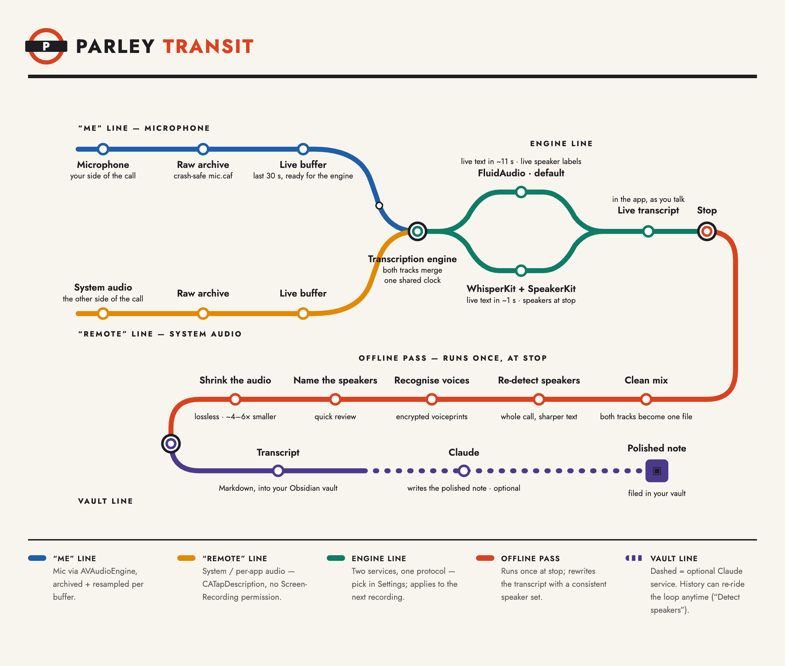

# Parley

A native macOS menu-bar app that records your **microphone** and **system / per-app
audio** as two separate tracks, transcribes them live with Whisper (on-device), and
writes a speaker-labeled Markdown transcript into your Obsidian vault — then optionally
runs your existing `process-meeting-transcript` Claude skill to produce a polished note.

Capturing the mic and the other side of the call **separately** is the whole point: it
labels who said what ("Me" vs "Remote") with no diarization ML, and it fixes the
"my mic filtered out everyone else" problem of single-stream recording.

## How it works

[](docs/architecture.html)

> The map reads left to right: the **"Me"** and **"Remote"** lines (mic + system audio,
> captured separately) interchange into the **engine line**, the red **offline pass**
> loop runs once at stop, and everything terminates on the **vault line** in Obsidian.
> Open [`docs/architecture.html`](docs/architecture.html) locally for the animated,
> interactive version.

Both transcription pipelines share **one** WhisperKit model behind a serializing actor
(lower memory + no Neural Engine contention); the per-track labeling comes from the
separate audio buffers, not separate models. Segment times are anchored to one shared
clock so the two tracks don't drift apart over a long meeting.

## Transcription engines

Parley has **two interchangeable transcription engines** behind one
`TranscriptionEngine` protocol. Choose in **Settings → Transcription → Engine**; the
choice applies to the *next* recording (no mid-session switch).

| Engine | ASR | Speaker labels | Latency |
|--------|-----|----------------|---------|
| **WhisperKit + SpeakerKit** | OpenAI Whisper (small / medium / large-v3 / turbo) | Per-speaker diarization + cross-session voiceprint ID (applied **at stop**) | **~1 s live text**; speakers labelled at stop |
| **FluidAudio** *(default)* | Parakeet TDT 0.6b **v3** (multilingual) | Per-speaker diarization + cross-session voiceprint ID | ~11 s live; corrected at stop |

There are two speaker-capable engines (pick in Settings → Transcription; applies to the next session). Both share the review / voiceprint / History machinery via the `SpeakerCapableEngine` protocol.

- **WhisperKit + SpeakerKit** — WhisperKit transcribes live (fast, ~1 s, track-labelled "Me"/"Remote"); at stop an **offline pass** builds the clean mix, re-transcribes it with word timestamps, diarizes it with **SpeakerKit** ([Argmax `argmax-oss-swift`](https://github.com/argmaxinc/argmax-oss-swift), MIT, pyannote v4 on the Neural Engine; pinned to a `main` commit until a tagged release ships the embedding API), and attributes words to speakers (diarization-first). Cross-session voiceprints reuse SpeakerKit's per-speaker centroid embeddings (256-d), tagged `pyannote_v3` so they never cross-match FluidAudio's prints. Models (~11 MB) download on first use; diarization is ~28× real-time. So the live transcript is snappy and speaker names appear after the recording stops.
- **(legacy) WhisperKit-only** ("Me"/"Remote", no diarization) is superseded by the hybrid above; `WhisperKitEngine` remains in the tree but is no longer selectable.
- **FluidAudio** is a self-contained native stack ([FluidInference/FluidAudio](https://github.com/FluidInference/FluidAudio), Apache-2.0, **pinned to `0.14.8`**). It keeps both taps but **mixes mic + system into one 16 kHz mono stream** (the far side of a call isn't audible on the mic alone) and runs everything from that single buffer:
  - **Transcription** — Parakeet TDT 0.6b v3, multilingual, via `SlidingWindowAsrManager` using the `.streaming` preset (~11 s chunks). The first text therefore appears after ~11 s — higher latency than WhisperKit, but it preserves the v3 model. (The low-latency end-of-utterance manager needs different, non-v3 models, so it's not used.) `v2` is English-only; `v3` (default) is multilingual.
  - **Diarization + speaker identification** — pyannote segmentation + WeSpeaker **256-d** embeddings (`embeddingModel` `wespeaker_v2`). Live labels come from ~10 s diarization chunks; at stop, one **offline pass** re-diarizes the whole recording for a consistent speaker set, optionally re-transcribes it with the full-context batch Parakeet model, and rewrites the saved transcript. Confident matches against saved voiceprints are auto-named and added to attendees.

Models download on first use to `~/Library/Application Support/FluidAudio/Models/`
(`parakeet-tdt-0.6b-v3/`, `speaker-diarization/`, …). Settings shows a **Download / Active**
control for the FluidAudio model.

### Implementation status

| Phase | Scope | State |
|-------|-------|-------|
| 0–1 | Recon + ASR/diarization smoke test (`tools/FluidSmoke`) | ✅ done |
| 2 | `TranscriptionEngine` protocol, `WhisperKitEngine`, live FluidAudio transcription, settings | ✅ done |
| 3 | Live diarization + per-segment speaker labels in the FluidAudio engine | ✅ done |
| 4 | `VoiceprintStore` — 256-d embeddings, cosine matching, configurable `identificationThreshold` | ✅ done |
| 5 | Enrollment / labeling UX (inline + at-stop review), auto-identify + auto-add to attendees, retained playable clips | ✅ done |
| 6 | Encrypted export / import / backup (Keychain + CryptoKit), Speakers management tab | ✅ done |
| 7 | Offline re-pass at stop: whole-recording diarization + optional batch-ASR re-transcribe | ✅ done |
| 8 | **WhisperKit + SpeakerKit** engine: WhisperKit ASR + SpeakerKit (pyannote v4) diarization at stop, shared `SpeakerCapableEngine` protocol, voiceprints (`pyannote_v3`), 2-option picker | ✅ done |

> **Speaker identification is biometric data.** Each voiceprint is stored with its
> embedding-model id (`wespeaker_v2`), dimension (**256**), and a schema version, and is
> **encrypted at rest** (AES-GCM, symmetric key in the Keychain; plaintext stores are
> migrated on load). Embeddings are **not portable across models** — if FluidAudio's
> embedding model changes on upgrade, saved voiceprints stop matching. Short enrollment
> audio clips are retained alongside each voiceprint, and **Settings → Speakers →
> Re-enrollment** regenerates the vectors from those clips (flagging outdated ones) so
> identities survive a model upgrade without re-recording. Two distinct thresholds exist
> and must not be conflated: FluidAudio's in-session `clusteringThreshold` /
> `diarizationThreshold` (groups voices within one recording, default **0.6**) vs. our
> cross-session `identificationThreshold` (matches a voice to a saved person, default
> **0.6**). Both are adjustable in **Settings → Transcription**, along with how much
> clean speech is required before a voice is auto-named. Speaker turns in the final
> transcript come from a **diarization-first** pass: the diarized turns are
> authoritative, and ASR words are grouped onto them.

## Requirements

- macOS 14.4+ (Core Audio process taps), Apple Silicon recommended
- [XcodeGen](https://github.com/yonyz/XcodeGen) (`brew install xcodegen`)
- Xcode 15.4+ toolchain
- The `claude` CLI (only if you enable auto note generation)

## Build & run

```bash
xcodegen generate          # regenerate Parley.xcodeproj from project.yml
open Parley.xcodeproj     # then run (⌘R)
# — or —
xcodebuild build -project Parley.xcodeproj -scheme Parley \
  -destination 'platform=macOS,arch=arm64'
```

### Local release (`tools/localrelease.sh`)

For a day-to-day **installed** build — an optimized Release `.app` in `~/Applications`
that you actually run between coding sessions — use the helper script instead of a raw
`xcodebuild`:

```bash
tools/localrelease.sh            # regenerate project, build Release, install to ~/Applications
tools/localrelease.sh --open     # …and launch it afterwards
```

It runs `xcodegen generate`, builds the `Parley` scheme in **Release**, and `ditto`s the
product into `~/Applications/Parley.app`, replacing the previous copy.

The important part is **signing**: the script mints (once) and reuses a self-signed
code-signing certificate named **`<PRODUCT_NAME> Local Codesign`** and signs every build
with it. A *stable* signing identity gives the app a constant **designated requirement**
(`identifier "com.naufalmir.parley" and certificate leaf = …`), which is what macOS keys
on for:

- **TCC permissions** — mic, system-audio capture, Documents/Desktop folder access
- **the keychain** — saved grants
- **the ANE cache** — `~/Library/Caches/<bundleID>/com.apple.e5rt.e5bundlecache`

Xcode's default fallback is *ad-hoc* signing, whose code hash changes on every build, so all
three are treated as a brand-new app each time — re-prompting for permissions and
re-specializing the CoreML models on the Neural Engine (the minutes-long `Specializing…`
step). Signing with the same cert avoids that churn.

> The cert is tied to the app **name** on purpose: rename the app (the `TODO(app-name)`
> sweep) and a new cert is minted — but the bundle id changes too, so a rename is one clean
> new identity by design. **The first launch after switching from ad-hoc to the cert
> re-prompts for permissions once; every rebuild after that keeps them.** This is a *local*
> identity only — not notarized, so the build runs on this Mac but is Gatekeeper-blocked
> elsewhere. For public distribution use the archive → export → notarize → staple flow.

### Opening in Xcode from the command line

`open` hands a path to its default app — `.xcodeproj` / `.xcworkspace` open in Xcode:

```bash
open Parley.xcodeproj                                   # this project (from the repo root)
open /Users/naufalmir/work/personal/parley/Parley.xcodeproj   # by absolute path, from anywhere
open -a Xcode                                             # just launch Xcode, no project
open -a Xcode Parley/Recording/RecordingController.swift  # open a single file to edit
```

> `Parley.xcodeproj` is **generated** by `xcodegen generate`. Open it to build/run with ⌘R,
> but make project-*setting* changes in `project.yml` — edits in the Xcode UI are overwritten
> on the next `xcodegen generate`.

The app runs as a menu-bar item (no Dock icon — `LSUIElement`). First launch will
prompt for **Microphone** access; the first recording prompts for **Audio Recording**
(system audio) access. There is no API to pre-request the audio-capture permission — it
appears when the first tap is created.

> Signing: ship **non-sandboxed** (Developer ID). Process taps, spawning `claude`, and
> writing into `~/ObsidianVault` are all incompatible with the App Sandbox. Entitlements
> live in `Parley/App/Parley.entitlements` (`app-sandbox: false`, `device.audio-input`).

## Settings

- **General** — Obsidian vault path, default capture mode
- **Transcription** — pick the **engine** (WhisperKit / FluidAudio — see [Transcription engines](#transcription-engines)); for WhisperKit, the Whisper model (small default; medium / large-v3 download on first use to `~/Library/Application Support/Parley/models`); for FluidAudio, the Parakeet v3 download / status
- **Notes** — toggle auto-run Claude, `claude` binary path, model, and the prompt template (`{{file}}`, `{{customer}}`, `{{attendees}}` are substituted)

## Verifying it works (manual — needs a GUI session)

1. **Capture** — start a recording while playing audio + speaking; stop. Check
   `~/Library/Application Support/Parley/Recordings/<session>/` has `mic.caf` + `system.caf`.
2. **Live transcript** — confirm "Me" and "Remote" lines appear in the menu popover as you talk.
3. **Vault write** — confirm a `YYYY-MM-DD-HHMM - <title>.md` lands in `Unsorted Transcripts/`,
   then run the existing skill manually to confirm format compatibility.
4. **Claude** — enable auto-run, stop a recording, confirm a note appears under `Internal/Customers/<Customer>/`.

## Known follow-ups (Phase 7)

Done:
- ✅ **Bounded session buffer** — each `TrackPipeline` trims confirmed audio off the front
  (sliding window + `windowOffset`), so memory stays flat regardless of meeting length.
- ✅ **Model unload on switch** — the recording-time model ref is cleared on stop and
  `ModelManager` releases the old model before loading a new one (no RAM stacking).
- ✅ **Latency logging** — pipelines log to the `perf` category when a decode falls behind
  real-time, plus each trim event (`~/Library/Logs/Parley/parley.log`).
- ✅ Fine-grained model **download progress** in Settings (explicit byte progress).

Remaining:
- `large-v3` may still lag real-time on a shared model; a chunked/near-real-time path
  could help (the `perf` logs now show when this happens).
- Crash-recovery checkpoint: periodically autosave a `.partial` transcript so a `SIGKILL`
  mid-recording doesn't lose the session.
- Audio level meters + notification-app filtering on the system track (capture confidence).
- Hard-crash cleanup: an aggregate-device leak is only possible on `SIGKILL` (normal quit
  tears it down via `applicationWillTerminate`).
